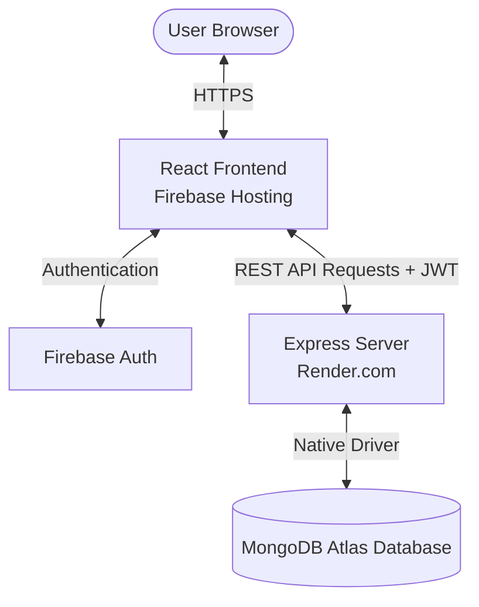
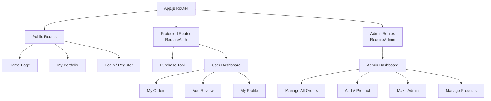

# FT Manufacturer House (Client-Side)

Welcome to the client-side repository for **FT Manufacturer House**, a modern, responsive full-stack manufacturing business-to-business web portal. This application enables industrial buyers to explore tool catalogs, place customized orders, manage purchases via a comprehensive user dashboard, and allows administrators to handle products, orders, and system settings.

## 🌐 Live Application
* **Live URL:** [https://ft-manufacturer-house.web.app/](https://ft-manufacturer-house.web.app/)

---

## 🎓 Academic Proof & Demonstrated Skills
Beyond academic courses, this project demonstrates practical web engineering skills through the development of a complete full-stack web project with a separate client-server architecture, REST API communication, database integration, and dynamic web application development.

* **Client-side Repository:** [https://github.com/farabi1/ft-manufacturer-house](https://github.com/farabi1/ft-manufacturer-house)
* **Server-side Repository:** [https://github.com/farabi1/ft-manufacturer-house-server](https://github.com/farabi1/ft-manufacturer-house-server)

**Demonstrated Skills:**
* Client-server architecture & RESTful API design
* Full-stack web development (MERN stack: MongoDB, Express.js, React, Node.js)
* Secure database-driven dynamic system integration
* User Authentication & Authorization using JWT and Firebase Auth

> [!NOTE]
> My GitHub account is registered under the email address: **rashidfarabi@gmail.com** (Ref: Section 7 of academic proof).
> 
> The web engineering skills acquired during my bachelor's studies are based on the curriculum at that time. The GitHub projects mentioned demonstrate that I have since expanded my knowledge to include modern technologies and current development standards.

---

## 🛠️ Technology Stack
* **Framework:** React.js (Single Page Application)
* **Styling & UI:** Tailwind CSS, daisyUI component library
* **Authentication:** Firebase Authentication (Email/Password, Google Sign-In)
* **State & Data Fetching:** React Query (TanStack Query)
* **API Communication:** Axios with interceptors for JWT authorization headers
* **Deployment:** Firebase Hosting

---

## 📁 Project Directory Structure

```text
ft-manufacturer-house/
├── public/                 # Static assets (HTML template, favicon, manifest)
└── src/
    ├── api.js              # Base configuration for backend API communication
    ├── App.js              # Application router and layout wrapper
    ├── firebase.init.js    # Firebase initialization config
    ├── index.js            # React application root entry point
    ├── index.css           # Global stylesheet and Tailwind config imports
    ├── components/         # Reusable presentation components & hooks
    │   ├── Banner/         # Home screen hero slider
    │   ├── Footer/         # Footer navigation component
    │   ├── Header/         # Responsive navigation bar
    │   ├── Hooks/          # Custom react hooks (e.g., token, user status)
    │   ├── Loading/        # Loading spinner animations
    │   ├── Parts/          # Catalog item cards & sections
    │   ├── Reviews/        # Customer testimonial components
    │   └── Auth Nested Route/ # Protected route wrappers (RequireAuth, RequireAdmin)
    └── pages/              # Application views & layouts
        ├── Home/           # Landing page featuring catalog summary, stats, reviews, and context
        ├── Auth/           # Login, registration, and password reset flows
        ├── Dashboard/      # Interactive dashboard (displays links dynamically based on user role)
        ├── Portfolio/      # Professional developer developer portfolio page
        └── Not Found/      # Custom 404 page
```

### 📊 System Architecture & Data Flow



### 🗺️ Frontend Navigation & Routing Structure



---

## 🚀 Getting Started Locally

### 1. Clone the repository
```bash
git clone https://github.com/farabi1/ft-manufacturer-house.git
cd ft-manufacturer-house
```

### 2. Configure Environment Variables
Create a `.env` file in the root directory and configure the variables:
```env
REACT_APP_API_BASE=http://localhost:5000
REACT_APP_API_KEY=your_firebase_api_key
REACT_APP_AUTH_DOMAIN=your_firebase_auth_domain
REACT_APP_PROJECT_ID=your_firebase_project_id
REACT_APP_STORAGE_BUCKET=your_firebase_storage_bucket
REACT_APP_MESSAGING_SENDER_ID=your_firebase_messaging_sender_id
REACT_APP_APP_ID=your_firebase_app_id
```

### 3. Install Dependencies & Start App
```bash
npm install
npm start
```
The application will run locally at [http://localhost:3000](http://localhost:3000).

---

## 📦 Deployment to Firebase Hosting

To push updates to production hosting:

1. **Build the production assets:**
   ```bash
   npm run build
   ```
2. **Deploy via Firebase CLI:**
   ```bash
   firebase login
   firebase deploy --only hosting
   ```
